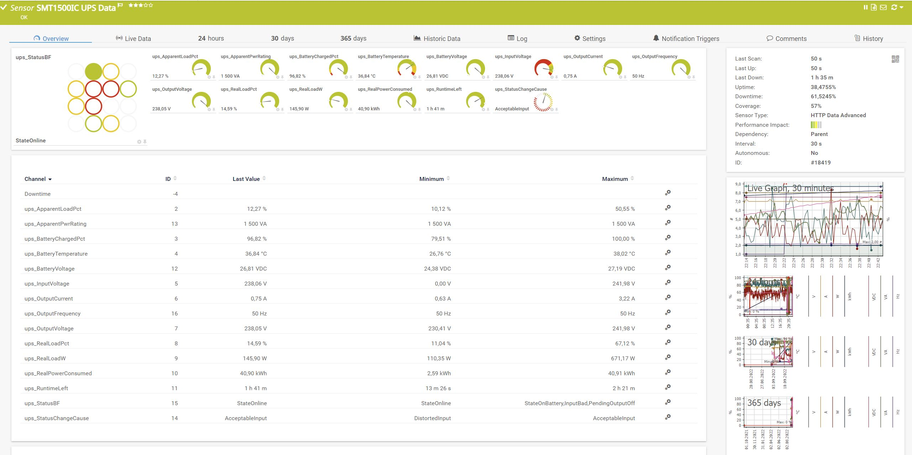
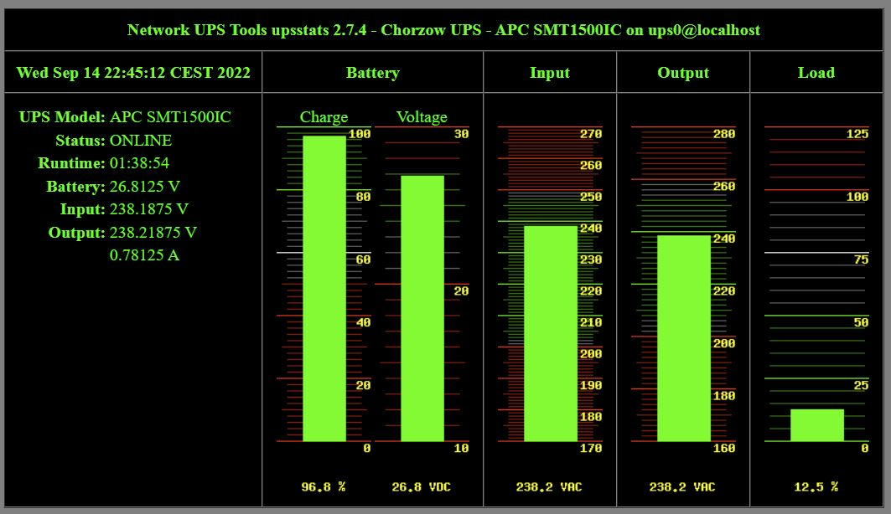

# PRTG-APC-MODBUS

Monitoring helper for PRTG Network monitoring system (https://www.paessler.com/), Network UPS Tools (https://networkupstools.org/) for APC UPS with APC SmartConnect. 

> No extra management card needed.

> You must enable MODBUS on the UPS before you run this script. 

## Usage
1. Configure IP addres, port and Unit ID of the UPS in `apc_modbus.py`
2. Remember to set webserver directory permissions (php writeable)
3. Each request will create two extra files:
    - `output.xml` for PRTG
    - `output.arr` for NUT driver

### PRTG specific
1. Upload sensor mappings to your PRTG (`.ovl` files)
2. Add HTTP Data Advanded / XML/REST sensor (https://www.paessler.com/manuals/prtg/http_xmlrest_value_sensor)



### NUT specific
Added support for NUT (https://networkupstools.org/)

Add your UPS to `/etc/nut/ups.conf` file:
```ini
[ups0]
    driver = dummy-ups
    desc = "Test UPS"
    port = /var/www/html/prtg-apc-modbus/output.arr
```


